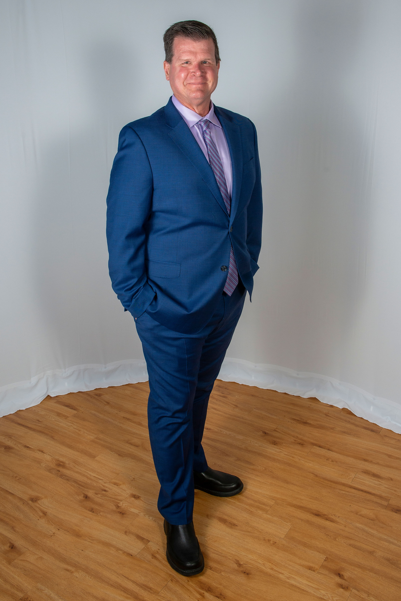

{width="163"}

Chair, Department of Economics \| rmcnab\@odu.edu \| 757-683-3153

## About

Professor Robert M. McNab currently serves as the Chair of the Department of Economics in the Strome College of Business at Old Dominion University. Dr. McNab is also the Director of the Dragas Center for Economic Analysis and Policy at Old Dominion University. He is a member of the Federal Reserve Bank of Philadelphia’s Survey of Professional Forecasters and, from 2018 to 2022, he was a member of the Joint Advisory Board of Economists for the Commonwealth of Virginia. Professor McNab has published in Applied Economics, Cornell Hospitality Quarterly, Defense and Peace Economics, National Tax Journal, Public Budgeting and Finance, and World Development, among others. He edits the annual State of the Region: Hampton Roads and State of the Commonwealth reports Professor McNab has appeared in the Associated Press, China Global Television Network, CNN, LiveNow from Fox News, Forbes, Newsweek, Wall Street Journal, Washington Post, Welt am Sonntag, Yahoo News, Yahoo Finance, Richmond Times-Dispatch, Virginian Pilot, Virginia Public Media, and Daily Press, among others. Dr. McNab joined the faculty of the Department of Economics in the Strome College of Business of Old Dominion University in July 2016 and previously was a member of the faculty of the Naval Postgraduate School in Monterey, California from 2000 to 2016.

## Contact Policy

Students should feel welcome to contact me via email at [rmcnab\@odu.edu](mailto:rmcnab@odu.edu){.email} or drop by Zoom office hours. I strongly encourage students to communicate with me. I will try to answer emails within 48 business hours (often much sooner) for course related topics.

Students should take the time to craft complete, professional emails. The more information that you can provide about a question or problem, the more likely that my response will be helpful. Avoid non-professional language and practice communicating in the corporate workplace. Emails that are unprofessional will be returned with no action.

Students should proactively address issues with the class and scheduling rather than waiting until an assignment or case study discussion is overdue. In many cases, accommodations can be made for ‘life events,’ however, clear and prompt communication is necessary.

## Virtual Office Hours

Office hours will be held on a rotating schedule and are available by appointment. Check the class announcements for the schedule of office hours, which vary to accommodate students with different schedules.
